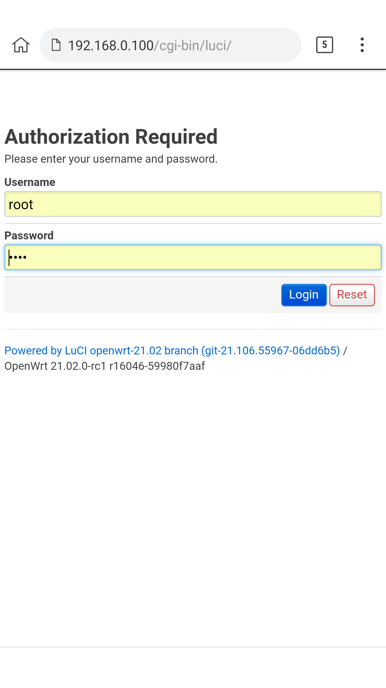
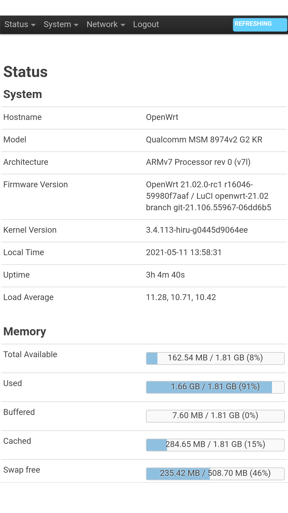
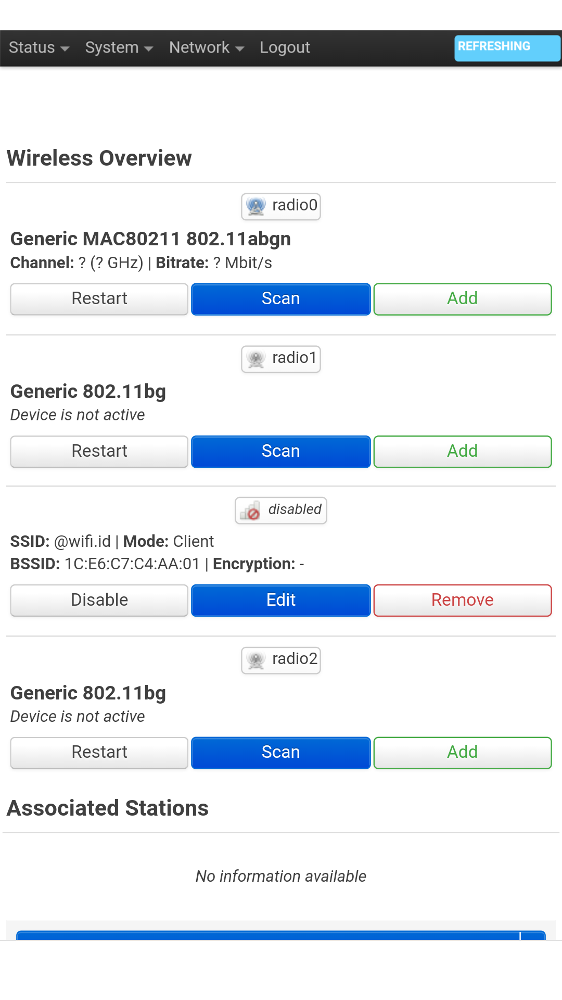
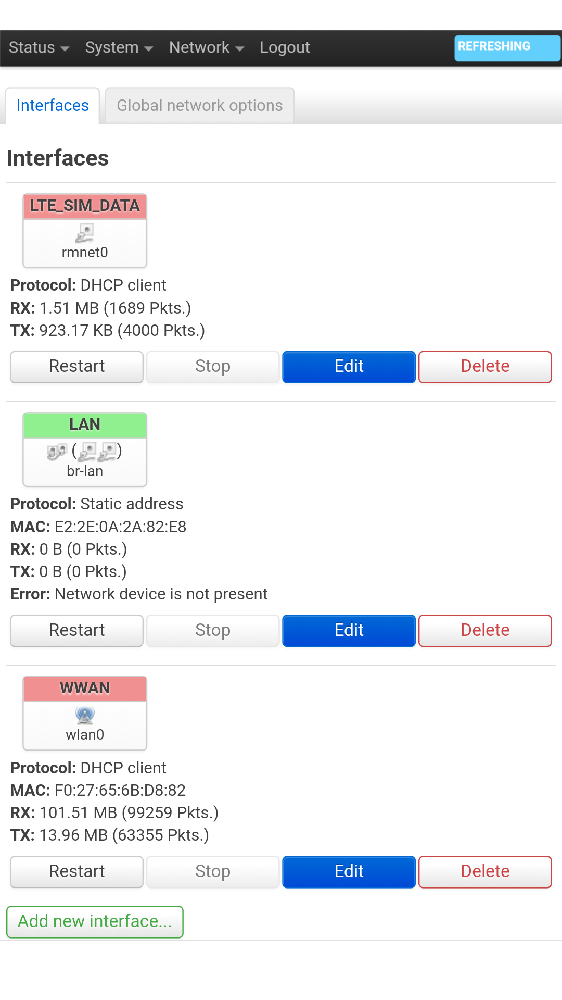
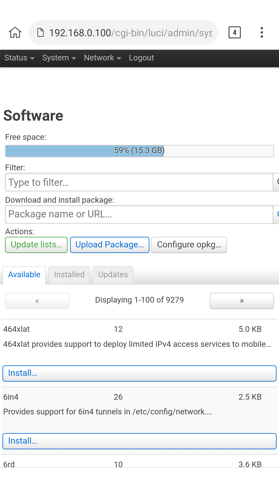

# OphoneWRT

OpenWrt which is generally installed on a wifi router device.
on this project I tried to design openwrt specifically to work on rooted android devices.
like Samsung, Sony, LG, Xiomi, Oppo, Vivo, Lenovo and others.

# tested device:
# .Samsung Tab 3V
# .Nexus 5/6
# .LG G4
# .LG G2 (D802) or (F320) series
# .Sony Xperia z1
# .LG V20
# .Xiomi mi4

# Screenshot

# INSTALLATION GUIDE
1. Download JandaWrt.zip file, extract to your sdcard

# [Releases](https://github.com/si-GILA/OphoneWRT/releases)

2. Download and install nh-term,nethunter app from

# [NethunterStore](http://store.nethunter.com)

3. open nethunter app and allow all permission
6. copy "scripts" folder from extracted JandaWrt.zip
7. go to /data/data/com.offsec.nethunter/files delete existing "sripts" folder and paste from copyed
8. back to nethunter app, go to -> ChrootManager -> Install chroot -> Install From Sdcard, point to downloaded rootfs tarbal file

# BOOT COMMAND
. Open Nh-Term app select AndroidSu tab
. type : "boot-wrt" to boot or start ophonewrt

# STOP COMMAND
. type : "kill-wrt" to stop or kill all running pids by openwrt

